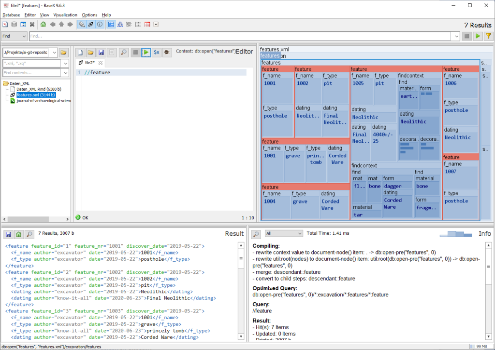

```{r setup, include=FALSE}
knitr::opts_chunk$set(echo = TRUE)
```

# Grundlegende Information

Das gesamte Thema im Kontext dieser Handreichungen auch nur einführend vorzustellen ist nicht möglich. Es werden also diverse Aspekte nur angerissen oder erwähnt oder stehen nur als Schlagworte im Text.  Ziel ist es, Ihnen das Thema "Daten & XML" im Kontext der Archäologie verkürzt vorzustellen und mit wenigen Beispielen Nutzungsszenarien aufzuzeigen. 

## Entwicklung und Forschungsgeschichte

Daten sammeln und nachnutzen, zur Recherche oder der Analyse, ist in den archäologsichen Fächern ein alltäglicher Vorgang. Meist sind es einzelne Tabellen, gelegentlich auch Tabellen mit Referenzen untereinander oder auch etwas komplexere relationale Datenbanken die hier zum Einsatz kommen. Daneben stehen aber auch andere Techniken zur  Strukturierung von Informationen zur Verfügung, eine sehr grundlegende ist die Auszeichnungssprache [XML](https://de.wikipedia.org/wiki/Extensible_Markup_Language).

Von dem eher technischen Aspekt der Sprache, z.B. XML oder SQL, ist das Konzept zur Strukturierung der Informationen zu trennen. Bedingt durch die jeweilige Enticklungsgeschichte stehen die vorgenannten Sprachen XML und SQL für sehr unterschiedliche Konzepte von Datenmodellen. SQL steht an den Anfängen der Datenbankentwicklung und für realtionale Datenbankmodelle. XML ist die jüngere und mit dem Internet eng verbundene Entwicklung, die zu semistrukturierten Daten in einer hierarchischen Baumstruktur führt.

Zu Beginn der 2000er wurde von Schloen ArchaeoML, ein auf XML basierendes und auf Objekte (*item*) zentriertes Datenmodell präsentiert [@schloenArchaeologicalDataModels2001]. Zeitgleich wird CIDOC-CRM entwickelt, welches ebenfalls auf XML und hieraus mit [RDF](https://de.wikipedia.org/wiki/Resource_Description_Framework) als auch [OWL](https://de.wikipedia.org/wiki/Web_Ontology_Language) entwickelten Relationen basierend, eine komplexe Ontologie für Informationen der Kutlurwissenschaften dartellt [@doerrCoreOntologyInformation2003]. Beide sind in ihrer Entstehung eng mit der Entwicklung des Internet verbunden und basieren im Kern auf XML, sind darüber hinaus aber sehr unterschiedlich [@kansaCommunityApproachData2005]. ArchaeoML ist in  [OCHRE](https://voices.uchicago.edu/ochre) aufgegangen und bildet auch eine Grundlage von [Open Context Hertiage Bytes](http://ux.opencontext.org/), z.B. bei [DINAA](http://ux.opencontext.org/archaeology-site-data/). Die weitere Entwicklung  von Open Context erfolgt auf [GitHub](https://github.com/ekansa) wobei GeoJSON-LD und damit der Raumbezug und die Referenzen unterienander zunehmend an Bedeutung gewinnen [Kansa 2014](http://ux.opencontext.org/2014/09/02/upgrading-open-context/). Auch CIDOC-CRM wird weiter entwickelt [@oldmanCIDOCConceptualReference2014] und vielfach als Grundlage für die Erfassung von Datenbeständen genutzt. Während CIDOC-CRM anfänglich stark an den Relationen orientiert war tritt nun auch hier das Objekt oder *item*, als Ding (*thing*), Objekt (*objekt*) oder (*feature*) verstärkt in das Zentrum.

Ausgehend von XML steht also das Element zunehmend im Zentrum der Strukturierung weniger die Relation von definierten Klassen wie es bei SQL eher der Fall ist. Weder XML noch SQL sind entgegen dieser sehr unterschiedlichen genuinen Konzeption aber auf die jeweiligen Modelle eingeschränkt.

## XML Nutzen

Zur Nutzung von XML-Datenbanken wurde [XQuery](https://de.wikipedia.org/wiki/XQuery) entwickelt. Grundlegendes Datenmodell ist eine Liste, mit keinem oder einem Element oder auch mehreren Elementen. Hierbei kann ein Element auch wiederum eine Liste sein. Diese als Sequenz bezeichnete Liste von Elementen entspricht damit der Struktur eines XML-Dokumentes. Bei XQuery spielen FLOWER-Ausdrücke ([flou-er], Blume) eine zentrale Rolle. FLOWER steht für *for, let, where, order by, return* und ist damit erkennbar an SQL orientiert (*SELECT, FROM, WHERE, ORDER BY*).

Eine Programm zur Nutzung von XML-Datenbanken und XQuery ist [BaseX](https://basex.org/) (s.u.). 

## XML in R / RStudio

Da ich diesen Text in R-Markdown mit RStudio schreibe verwende ich sogenannte *code chunks*, um die Befehle darzustellen. Mit den Paketen [xml](https://cran.r-project.org/web/packages/XML/index.html) oder [xml2](https://xml2.r-lib.org/) können XML-strukturierte Daten in R genutzt werden, dabei handelt es sich allerdings um sogenannte *wrapper* mit einer typischen R-Syntax und nicht um die Implementierung einer XML-Sprache wie z.B. [XQuery](https://de.wikipedia.org/wiki/XQuery).  Beide Pakete haben jeweils eigene Dokumentationen ([xml](https://www.rdocumentation.org/packages/XML), [xml2](https://www.rdocumentation.org/packages/xml2)). Die Pakete bieten einige unterschiedliche Funktionen, z.B. xmlToDataFrame() bei xml und unterscheiden sich weitgehend in den Fundktionsnamen: "xml_\<Beschreibung>" bei xml2.  

XQuery wird in R nicht umgesetzt, die nachfolgenden *code chunks* mit XQuery sind demnach funktionsloses Layout ohne hervorgehobene Syntax. Für die Nutzung der Pakete xml und xml2 sind einführende Beispiele in der oben genannten Dokumentation vorhanden.

# Software

XML-Daten und deren Nutzung sind eng mit dem Internet verbunden (s.o.). Die zugehörige Software setzt deshalb meist einen Server (z.B. [*localhost*](https://de.wikipedia.org/wiki/Localhost)) und [PHP](https://de.wikipedia.org/wiki/PHP) voraus.

## BaseX

[BaseX](https://basex.org) ist plattformunabhängig, wird unter Open-Source-Lizenz (BSD) angeboten und für Windows gibt es ein eigenes Installationsprogramm.  BaseX wird auf [GitHub](https://github.com/BaseXdb) weiter entwickelt. Die Website des Projektes bietet eine umfassende [Dokumentation](https://docs.basex.org/wiki/Main_Page), darunter auch eine knappe Einführung zu der nachfolgend genutzte [GUI](https://docs.basex.org/wiki/Graphical_User_Interface) die für mich der hervorzuhebende Aspekt dieser Software ist. Für den ersten Kontakt mit XML, XPath und XQuery empfehle ich auch den Text [Basex for dummies von Paul Swennenhuis](http://www.swennenhuis.nl/basexfordummies/BaseX_for_dummies.pdf).

> Die GUI von BaseX erlaubt die Recherche in den Daten mit XPath und XQuery, das Editieren von Daten ist hier nicht möglich. 

# XML Grundlagen

XML besteht aus Elementen (s.o. Sequenz) die auch als Knoten eines Baumes bezeichnet und dargestellt werden. Jedes Element kann Attribute besitzen und einen Wert oder weitere Elemente beinhalten. Ein Beispiel ist:

```
<text autor="Sepp Herberger">
  <satz>
    <wort typ="artikel">Der</wort> 
    <wort typ="substantiv">Ball</wort> 
    <wort typ="verb">ist</wort> 
    <wort typ="adjektiv">rund</wort>
    .
  </satz>
</text>
```

Das Wurzel-Element des Beispieles ist ```\<text>...\</text>``` mit den weiteren Elementen "satz" und "wort" die neben den *start tags* ebenfalls zugehörige *end tags* besitzen. Das Element "text" besitzt das Attribut "autor" und das Element "wort" das  Attribut "typ". Dabei ist das Attribut "typ" für "wort" gut gewählt, da es eine eindeutig Zusatzinformation ist während wir für einen Text auch mehrere Autoren erwarten können und deshalb mit den Elementen "autoren" und "autor" statt einem Attribut arbeiten sollten.  

```
<?xml version="1.0" encoding="UTF-8"?>
<kml xmlns="http://www.opengis.net/kml/2.2" xmlns:gx="http://www.google.com/kml/ext/2.2">
```

Wenn Sie wohlgeformte komplexere XML-Dateien in einem Editor öffnen, z.B. KML-Dateien, sehen Sie als erstes eine Deklaration und auch Verweise auf anzuwendende Regelwerke. Der folgende Beispieldatensatz ignoriert dies. 

{width=75%}

## XML Beispieldaten

Starten Sie für die Arbeit mit den Beispieldaten das Programm **BaseX**. Mit "Database > New ..." öffnen Sie einen Ordner mit XML-Dateien oder eine einzelne XML-Datei und weisen dieser Datenbank einen Namen zu. Mit "Databases > Open & Manage ..." können einmal angelegte Datenbanken erneut geladen werden. Is die Datenbank "features" in BaseX geladen sollten Sie annähernd vorangehende Bild sehen.  

Unterhalb der üblichen Menü- und Icon-Leiste sehen Sie folgende Fenster: Projekt-Ordner, Editor für Syntax, *Map* der Datenbank, *Result* mit aktuell dem gesamten Datenbestand und *Info*. Diese Fenster können über das Menü unter *View* und *Visualization* auch an und ausgeblendet werden.

## XPath 


## XQuery


# Zitierte Literatur
