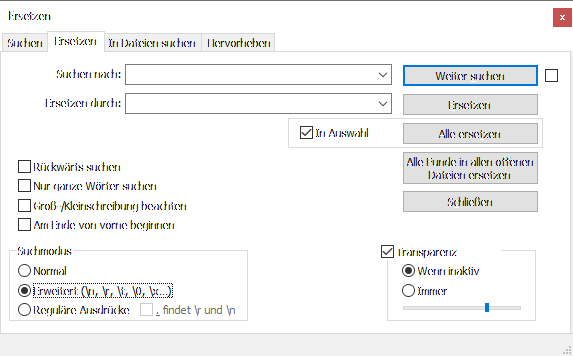

```{r setup, include=FALSE}
knitr::opts_chunk$set(echo = TRUE)
```

# Grundlegende Information

Quelle: https://notepad-plus-plus.org/

Lizenz: "*This program is free software; you can redistribute it and/or modify it under the terms of the GNU General Public License as published by the Free Software Foundation; either version 2 of the License, or (at your option) any later version.*"

Version für diese Handreichung:

- Notepad++ v7.8.5   (32-bit)
- OS Name : Windows 10 Enterprise (64-bit) 
- Plugins : 
	- ComparePlugin.dll
	- DSpellCheck.dll
	- MarkdownViewerPlusPlus.dll
	- mimeTools.dll
	- NppConverter.dll
	- NppExport.dll
	- NppMarkdownPanel.dll
	- NppTextFX.dll

Notepad ++ ist für mich ein Schweizer Taschenmesser im Bereich des Editierens. Seine Funktionalität geht bei Bedarf über die eines schlichten Editors wie z.B. notepad.exe von Windows  weit hinaus. Diese Programme sind schlicht nicht zu vergleichen. Das folgende Intro geht nur auf die wenigen Bereiche ein, für die ich Notepad++ nutze, es gibt viel mehr zu entdecken. Aktuell verwende ich die 32bit Version wegen der zur Verfügung stehenden Plugins. 

Notepad ++ gibt es ausschließlich für Windows. Die Homepage verweist auf [Scintilla](https://www.scintilla.org/) als Vorbild aus Linux hin. Eine mögliche Alternative unter Linux wäre sicher auch [Emacs](https://www.gnu.org/software/emacs/). Das kann ich aber nicht beurteilen.

Dieser Text will vor allem zwei Dinge: 1. die Bedeutung des "schlichten" Textformates und seiner Möglichkeiten hervorheben und 2. auf einige Möglichkeiten von Notepad++ hinweisen. 

# Text und ohne Plugins

Schon in der Grundkonfiguration gibt es bemerkenswerte Funktionalität.

## Kodierungen
Wer kennt Sie nicht, die seltsamen Zeichen "&eth; &copy; &thorn;" in diversen Programmen. Schuld ist, wie so oft, eine fehlerhafte Kommunikation. Der Weg von der binären Speicherung (0 1) bis zum dargestellten Zeichen ist nicht wirklich kompliziert nur durch die Geschichte der IT und den weltweiten Bedarf an diversen Zeichen komplex geworden. Von zentraler Bedeutung ist hier die *codepage* oder Zeichentabelle. Diese übersetzen die in 8-Bit (1 Byte) codierten Werte in die uns bekannte Repräsentation, z.b. "A". Gängige *codepages* sind heute UNICODE UTF-8 oder UTF-16 LE (little-endian). Bekannt ist immer noch ASCII, gehört aber eher zu den *pebble-tools* der IT, während DOS-Latin-1 (cp 850) noch und ANSI oder Windows (cp 1252) aktuell vorkommen.

Anmerkung: BOM steht für Byte-Order-Mark, tritt nur bei UTF-Zeichencodierung auf und ist ab UTF-16 notwendig, um Eindeutigkeit zu schaffen.

Notepad ++ **\[Kodierung]** bietet die Möglichkeit, zwischen vielen Zeichentabellen zu wechseln und zu konvertieren. Das schafft Eindeutigkeit und erlaubt einem ein bewusstes Handeln zugunsten einer fehlerfreien Kommunikation. Halten Sie sich bei der Kodierung an weit verbreite Standards, z.B. UTF-8 (**interoperable**). Ein Hinweis auf die verwendete Kodierung ist kein muss, erleichtert aber den Zugang (**accessible**). 

Gute Programme, z.B.  Libre Office und QGIS, bieten beim Import die Auswahl einer passenden Zeichentabelle an und bieten eine Voransicht des Ergebnis. 

## Sprache
Neben den Zeichen ist die Sprache ein zentrales Element der Verständigung. Die englischen Begriffe im Text sind Ihnen vermutlich eher wegen der kursiven Setzung als wegen der Sprache aufgefallen. Eventuell ist ihnen Folgendes schon mal untergekommen:

```d<-paste('x:', x_coord, sep=' ')``` oder ```concat('x: ', $x)``` oder ```verketten=("x: "; A1)```. 

Schön wäre es, wenn Sie auch dies gleichfalls überlesen hätten. In allen Fällen werden Elemente verkettet, es sind Beispiele von Syntax aus R (Statistik), aus QGIS und MS Excel.
Sprachen in der IT und hier bei Notepad ++ meint in der Regel eine der vielen Computersprachen die vor allem einen Zweck haben, sie müssen als Handlungsanweisung *maschinenlesbar* sein. In vielen Fällen sind sie zudem *menschenlesbar*, wie z.B.: ```select table1.var1, table1.var2 from table1;``` (SQL).

Lassen Sie sich von diesem Thema also nicht gleich ins Bockshorn jagen. (So ist das mit der Sprache, sie entwickelt und entfremdet sich bisweilen, das Verständnis bleibt hoffentlich.)

**\[Sprachen]** in Notepad ++ sind jetzt nicht Übersetzer oder erlauben *a priori* das Ausführen der Anweisung, aber sie bieten ein sogenanntes Syntax-*highliting*, also eine Hervorhebung der spezifischen "Grammatik" und damit eine Schreib- und Lesehilfe. Ich nutze dies unter anderem für HTML, XML, LISP, SQL und wie hier für Markdown. Bei Auszeichnungssprachen (HTML, Markdown) kann diese auch direkt umgesetzt werden. Computersprachen sind nicht unbedingt einfach aber extrem stark strukturiert und haben sehr selten Ausnahmen. Wenn Sie also sog. Fremdsprachen beherrschen (Französisch, Englisch, Spanisch etc.) ist HTML, SQL und R kein wirkliches Problem für Sie, nur eben Vokabeln lernen. 

Anmerkung: Sollten Sie ernsthaft Programmcode schreiben wollen, sollten Sie auf weitere Softwareangebote zurückgreifen, z.B. [Anaconda](https://www.anaconda.com/) und [JetBrains](https://www.jetbrains.com/). 

## Ansicht
Unter **\[Ansicht]** nutze ich  - vor allem im Unterricht - das schnelle Zoomen mit **\<strg>** + Scrollrand oder **\<+>**/**\<->**.
Der **\[automatischer Zeilenumbruch]**, auch über die Iconleiste schnell erreichbar, ist (ausgeschaltet) oft nützlich und **\[Symbole anzeigen]** bietet bisweilen hilfreiche Information über die Struktur des Textes und unsichtbare Elemente wie Tabulatoren oder Zeilenumbrüche.

## Bearbeiten bzw. Editieren
Zwei Optionen müssen hervorgehoben werden: Suchen & Ersetzen und der Spaltenmodus. Weitere, von mir gerne genutzte Funktionalitäten (Zeilen sortieren, UPPER CASE, Propper Case, trim, wrap, quote...) bietet das Plugin TextFX.

Der **\[Spaltenmodus]** erlaubt das Markieren und demzufolge Kopieren, Ausschneiden und Einfügen von Spalten. Es funktioniert mit **\<alt>** + **Mauswahl** oder **\<alt>** + **\<shift>** + **Pfeiltasten**. Der Cursor steht bei der zweiten Variante zu Beginn natürlich am Anfang oder am Ende des zu wählenden Bereichs.

**\[Suchen]** & **\[Ersetzen]** ist ein ganz wichtiges Thema. Notepad ++ bietet hier alles, zumindest fehlt mir nichts.

{width=50%}  

Neben allgemein üblichen Parametern die in diesem Fenster ausgewählt werden können, sind es die Optionen: Normal, Erweitert (\\n, \\r, \\t ...) und Reguläre Ausdrücke die hervorzuheben sind. "Normal" entspricht einer allgemeinen Erwartung.

### Reguläre Ausdrücke

Die zweite Option **Erweitert** bei [Suchen] & [Ersetzen] ist schnell erklärt:

- \\n : new line, line feed (LF) oder neue Zeile
- \\r : carriage return (CR), Wagenrücklauf
- \\t : tablulator, Tabulator

Sie können diese unsichtbaren Zeichen suchen und ersetzen. In diesem Kontext ist die Ansicht der unsichtbaren Symbole hilfreich (s.o.), der Zeilenumbruch setzt sich in der Regel zusammen aus \\[CR]\\[LF] also \\r\\n.

Der dritte Punkt **Reguläre Zeichen** (*regular expressions*, *RegExp*) ist ein umfangreiches aber extrem spannendes Thema, die Regeln haben Allgemeingültigkeit, leider mit Variationen.
Es können hier nur Grundlagen angerissen werden, weitere Informationen und Beispiele finde Sie u.a. auf folgenden Websites [Regulare Expressions](https://www.regular-expressions.info), [w3schools](https://www.w3schools.com/jsref/jsref_obj_regexp.asp) und  [reger](https://regexr.com).

Aktivieren Sie unbedingt die Option "Groß-/Kleinbuchstaben beachten"!

- [0-9] findet jede Ziffer, [A-Z] findet alle Großbuchstaben von A bis Z, [a-z] entsprechend Kleinbuchstaben, [123] findet 1 oder 2 oder 3 und [Aa] findet A oder a.
- Die Negation erfolgt mit ^ also [^Aa], das Zeichen steht aber auch für den Zeilenanfang, z.B. \^[Aa]. 
- Mengenangaben erfolgt mit: + mindesten 1x also [a-c]+, \\* null oder mehrfach: [a-c]\\* , ? null oder 1x, \\{n} genau n-mal, \\{n,m} genau n- bis m-mal.
- Besondere Zeichen: \\. jedes Zeichen außer \\r oder \\n, \\w Wordzeichen, \\d (digit) Alias für [0-9], \\b Anfang oder Ende eines Wortes, $ Zeilenende. 

Als praktisches Beispiel eine Tabelle aus QGIS per copy 'n paste in den Editor kopiert, wobei die Koordinaten als WKT (Well Known Text) standardmäßig integriert sind 

```
Point (4427443.118862709030509 5750583.55983530264347792) | 1009100 | P91
Point (4427441.34842063020914793 5750582.72421383764594793) | 1009200 | P92
Point (4427440.87541054934263229 5750585.79514600615948439) | 1009500 | P95
Point (4427444.95572871062904596 5750585.13951831124722958) | 4002 | XLb
Point (4427450.40615627821534872 5750546.4970451956614852) | 101 | Ia
Point (4427450.96178238932043314 5750547.88611047342419624) | 101 | Ib
```
Anm.: Im Codefenster wird das \\t als Spaltentrenner nicht wie gewünscht dargestellt, deshalb ist es mit | ersetzt.

Aufgaben:

Die Koordinaten sind viel zu lang bzw. zu genau und sollen gekürzt werden. Eine Möglichkeit, wir suchen  entsprechend viele Ziffern, z.B. 7, gefolgt von " " oder ")" also *Suchen nach:* ```\d{7}[ )]```, *Ersetzen durch:* ```NULL```. Das funktioniert, da der Spaltentrenner ein \\t ist und nicht ein " ". Aber doch nicht richtig, da das  " " und die ")" verschwinden. Die bessere Lösung folgt unten.

Sie brauchen nur die Koordinaten und wollen alle folgenden Spalten löschen, also vom ersten \\t alles bis zum Zeilenumbruch: ```\t.*\r\n``` oder besser ```\t.*$```. Das war einfach. 

Der erste Fall oben ist zu simpel, eigentlich soll jede Koordinaten genau 5 Nachkommastellen haben. Wir müssen also drei Suchelemente definieren:

  1. Suche genau 5 Ziffern nach einem Punkt: .[0-9]{5}
  2. Suche beliebig viele Ziffern: [0-9]\* 
  3. Suche ein Leerzeichen oder schließende Klammer: [ )] 
  
Nur der mittlere Block soll ersetzt werden. Das mit den 3 Elementen wird mit Klammern () einfacher lesbar und! maschinenlesbar gegliedert: 

```(.[0-9]{5})([0-9]*)([ )])``` 

Auf diese Elemente können wir uns nun beziehen und diese getrennt behandeln: ```\1\3```. Übersetzt steht da: das 1. Element behalten, das 2. Element fällt weg, das 3. Element behalten. Fertig.  

Auch wenn Sie es ggf. nicht wissen wollen, in R können RegEx mit der Funktion gsub() ausgeführt werden, in QGIS gibt es einige Funktionen, die sinnig mit "regexp_" beginnen und das ist bestimmt nicht alles. 

**Anmerkung**: Der gesamte Komplex **Suchen & Ersetzen** kann auf alle offenen Dateien oder aber auf alle oder gefilterte Dateien eines Ordners angewendet werden.  

## Drucken
Sie können Textdateien auch drucken, es empfiehlt sich aber vorab das Layout unter **\[Einstellungen]** > **\[Optionen]** zu definieren. Also mindestens die Seitenränder (mm) angeben. Rein aus Gewohnheit setze ich das Elemennt *Page* in die Fußzeile rechts unten und *File name* zur Dokumentation unten links. 


# Plugins

Eine lange Liste von Plugins finden Sie unter **\[Erweiterungen]** > **\[Plugin-Verwaltung]**, einige haben sprechende Namen wie "PyNPP" andere weniger "Pork to Sausage". 

## ComparePlugin
Der Name sagt alles und ein zugehöriges Bild mehr als tausend Worte.

{width=75%} 

Das Plugin kann vielfältig angepasst werden. Zudem hat es einige ergänzende Optionen, die weitgehend selbsterklärend sind und leicht selbständig ausprobiert werden können.

## DSpellCheck
Dieses Plugin überprüft die Rechtschreibung und nutzt dafür standardmäßig die Hunspell Bibliothek, optional auch Aspell. Deutsch muss zusätzlich heruntergeladen werden, dies ist aber mit dem Plugin auf "Knopfdruck" möglich. Alles Weitere auf der Website in einer umfangreichen [Dokumentation](https://github.com/Predelnik/DSpellCheck/wiki/Manual).
Es gibt ein weiteres Plugin Spell-Checker, der Funktionsumfang scheint aber deutlich geringer.

## NppTextFX.dll
Das Plugin trägt sich als eigenständiger Menüpunkt ein, das ist bei dem Umfang an Funktionen auch geboten. Sehr stark vertreten sind diverse Ersetzungsfunktionen, die u.a. Artefakte von Auszeichnungssprachen (z.B. HTML) bereinigt. Ich nutze zwei Funktionsbereiche sehr häufig:

1. Unter *TextFX Characters*: UPPER CASE, lower case, Propper Case und Sentance case.
2. Unter *TextFX Tools*: Sort... für das Sortieren von Zeilen in einem markierten Bereich.

## MarkdownViewer++ und MarkdownPanel

Zwei Aspekte müssen hier vorgestellt werden: 

1. Was ist Markdown und wofür kann es nützlich sein? 
2. Zwei Plugins die Markdown ermöglichen und jeweils Stärken als auch Schwächen haben.

### Markdown

[Markdown](https://markdown.de) ist eine Auszeichnungssprache mit einiger Ähnlichkeit zu HTML. Benötigt wird ein Texteditor oder auch ein spezieller Markdown-Editor (z.B. [Typora](https://typora.io/)) oder Sie nutzen RStudio mit R-Markdown. Ziel ist es, sich auf das Schreiben zu konzentrieren ohne die überbordenden Funktionsleisten der Textverarbeitung. Wesentliche Layout-Elemente lassen sich durch einfache Auszeichnung bewerkstelligen. Kurze Texte, z.B. Protokolle oder auch diese Handreichung lassen sich schnell erstellen und als MD oder PDF (Portable Dokument File) verteilen. Da reiner Text vorliegt, ist kollaboratives Arbeiten in [GitHub](https://github.com/) möglich. Das Ziel ist **keine LaTeX-Alternative**, sondern schnelles plattformunabhängiges  Erstellen klar strukturierter Texte.

Markdown schreiben ist einfach. Dabei ist auf Leerzeilen zwischen Absätzen oder vier Leerzeichen am Zeilenende als klare Trennung zu achten. Wichtige Layout-Elemente sind:
```
# Überschrift 1. Ordnung    

# Überschrift 2. Ordnung    

- Gliederungsebene 1 
    - Gliederungsebene 2
        - Gliederungsebene 3

Einfacher Text, *kursiver Text* und **fetter Text**.

Eine Linie wird mit \--- erzeugt und 
Sonderzeichen wie *  oder \ müssen mit \ ausgezeichnet werden: \* \\

| Spaltenüberschrift 1 | Spaltenüberschrift 2 | Spaltenüberschrift 3 |
| ----|----|----|
| Inhalt 1 |Inhalt 2 | Inhalt 3 |

Programmcode wie dieser Textabschnitt wird von drei *Accent grave* am Anfang 
und Ende eingeschlossen: 

\``` code \``` (Hier beißt sich die Katze in den Schwanz, die "\" bitte ignorieren.) 

Ein *inline* Hyperlink sieht so aus [Markdown](https://markdown.de).

Bilder werden ähnlich eingebunden {width=10}
```

Die visuelle Umsetzung hängt etwas vom Editor und in Nodepad++ vom gewählten MarkdownViewer ab.

**Überschrift 1. Ordnung**

**Überschrift 2. Ordnung**  

- Gliederungsebene 1 
    - Gliederungsebene 2
        - Gliederungsebene 3

Einfacher Text, *kursiver Text* und **fetter Text**.

Eine Linie wird mit --- erzeugt und 
Sonderzeichen wie \* oder \ müssen mit \ ausgezeichnet sein, um bedeutungslos zu werden.

| Spaltenüberschrift 1 | Spaltenüberschrift 2 | Spaltenüberschrift 3 |
| ----|----|----|
| Inhalt 1 |Inhalt 2 | Inhalt 3 |

Programmcode wie dieser (obige) Textabschnitt wird von drei *Accent grave* am Anfang 
und Ende eingeschlossen: 

``` code ``` (Hier beißt sich die Katze in den Schwanz, die "\\" bitte ignorieren.)

Ein *inline* Hyperlink sieht so aus [Markdown](https://markdown.de).

Bilder werden ähnlich eingebunden {width=10}

## MarkdownViwer++

Dieses Plugin öffnet ein zweites Fenster, in dem die Umsetzung der Auszeichnung direkt visualisiert wird.  Ein Export zu PDF und HTML ist auf "Knopfdruck" möglich. Bei den Optionen können die Seitenränder (mm) für das PDF eingestellt werden. Leider hat dieses Plugin zwei Schwächen. 

1. Die Darstellung der Tabelle ohne Linien und Durchschuss ist nicht wirklich schön.
2. Bilder können mit der Standardsyntax nicht eingebunden werden. 

``````

Hier muss auf die stets mögliche Alternative HTML zurückgegriffen werden. Dies bietet zugleich auch mehr Optionen:

``` ```

Leider entsteht dann eine missliche Abhängigkeit vom Betriebssystem (\\ statt /).

## NPPMarkdownPanel

Auch dieses Plugin öffnet ein zweites Fenster, in dem die Umsetzung der Auszeichnung direkt visualisiert wird. Der Export in PDF erfolgt über "*Druckvorschau*" im Kontextmenü (rechte Mausklick) der Voransicht. Hier können die Seitenränder verschoben werden und nachfolgend ist der Druck auf jeden installierten Drucker, z.B. PDF24 oder FoxitReader möglich. Die Umsetzung der Tabellen ist deutlich besser gelöst, ebenso die Darstellung von Code in dezenten Textboxen mit horizontalem Scrollbalken bei langem Code. Die Darstellung von Bilder ist mit der Standardsyntax von Markdown problemlos auch mit relativen Pfaden möglich. In diesen Punkten schneidet das Plugin deutlich besser ab.

Hinzu kommen noch Seitenzählung und Druckdatum in der Druckvorschau. Ein wesentlicher Nachteil ist das erstellte PDF, nur die Code Abschnitte sind Text, der Rest wird als Bild hinterlegt. Damit ist diese Datei deutlich größer und vor allem in der Nachnutzung mangelhaft. Damit fällt dieses Plugin für eine PDF-fokussierte Nachnutzung leider aus.
