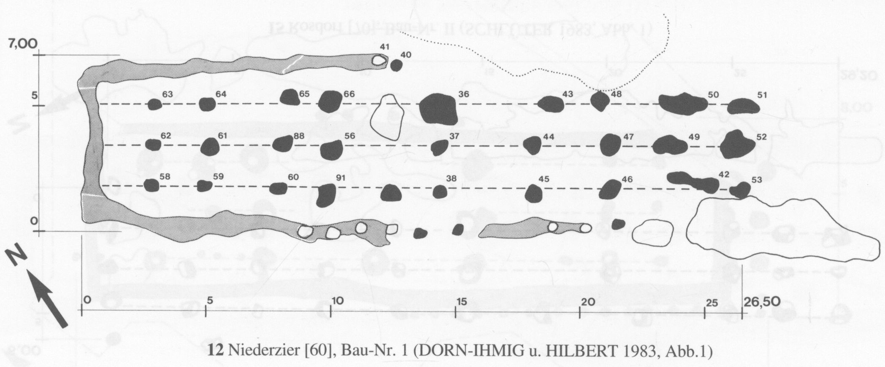

```{r setup, include=FALSE}
knitr::opts_chunk$set(echo = TRUE)
```

# Grundlegende Information

Quelle: [https://imagej.net](https://imagej.net)

Die Software ist open source und wurde für die wissenschaftliche Bildanalyse entwickelt. 

Das Programm ist in Java programmiert, deshalb muss eine Java-Laufzeitumgebung (JRE) installiert sein. Ohne in Details zur Lizensierung von Sun Microsystems und Oracle einzusteigen empfiehlt sich die Verwendung von [Adopt-OpenJDK](https://adoptopenjdk.net/). In Java geschriebene Programme sind weit verbreitet und plattformunabhängig, können also unter Windows, MacOS und Linux betrieben werden.

Installieren Sie erst ImageJ, vermutlich ist auf Ihrem PC eine Java Laufzeitumgebung bereits installiert. Aktuell liegen zwei Distributionen des Programms vor, auf der Homepage wird die Installation von [Jiji](https://imagej.net/Fiji/Downloads) wegen Updates und Kompatibilität mit Java 8 empfohlen. 

## Anwendung und Nutzungszenarien

Die Software dient der Bildanalyse, ein typischer Fall wäre das Auszählen und die Flächenbestimmung von spezifisch gefärbten Zellen. Das spätere archäologische Beispiel nutzt diese Möglichkeit, um die Flächen von Pfostengruben in Plänen zu ermitteln.

- Für gute Ergebnisse sollten Sie mit nicht komprimierten Bildern arbeiten, also keine JPG-Dateien, sondern TIF oder BMP verwenden. Beachten Sie hierzu die Hinweise der Software.

## Installation

Laden Sie die Installationsdatei der Distribution [Fiji](https://imagej.net/Fiji/Downloads) herunter. Die Installationsanleitung für Windows-Systeme empfiehlt die Installation in einem Ordner innerhalb Ihres Nutzerverzeichnis (C:\\Users\\<name>) anstatt des üblichen Programmordners (c:\\Program Files). Dadurch werden möglich Probleme mit Zugriffsrechten bei der Nutzung der Software vermieden. Weitere Informationen finden sich auf der [Website](https://imagej.net/Getting_started) 

## Tutorials

Das Programm richtet sich an Wissenschaftler, es ist sehr funktional allerdings weniger intuitiv in der Handhabung. Auf der Website finden sich [Einführungen und Tutorials](https://imagej.net/Category:Tutorials.html#Tutorials_provided_by_microscopy_facilities) vom Einstieg bis zum Skripten und für diverse Nutzungsszenarien. Diese sind umfassend, sie gehend z.B. auch auf die Wahrnehmung und Definition von Farbe ein, woraus sich ein erhöhter Leseaufwand ergibt. 

## Programmfenster

Es gibt nicht ein einziges Programmfenster sondern eine zentral Menü- und Iconleiste sowie getrennten Fenstern für Dateien und Werkzeuge. Diese Fenster sind frei positionierbar und der Wechsel ist wie üblich mit der Tastenkombination \<Alt> + \<Tab> leicht möglich. 

# Anwendungsbeispiele

Nachfolgen werden einzelne Anwendungsbeispiele vorgestellt.

## Pfsotengruben in Graustufenbildern

Ziel ist die Ermittlung der Fläche von Pfostengruben in Plänen von  neolithischen Häusern. Das folgende Beispiel verwendet eine eingescannte Abbildung aus Luley (1988). Für die Auswertung wurde ein TIF genutzt, die hier dargestellte Datei ist ein JPG.



Dieses Bild ist ursprünglich schwarz-Weiß mit einem Druckraster, die Filterung der relevanten Farbflächen (Pixel) über einen Graustufen oder Farbwert also nur bedingt hilfreich. Es wird deshalb später zusätzlich mit Schwellwerten für die gemessene Fläche gearbeitet.

Mit File > Open (\<Srtg> + <o>) öffnen Sie das Bild. Markieren Sie das Linien-Icon und zeichnen Sie mit gedrückter Maustaste eine Linie über eine definierte Länge des abgebildeten Maßstabes (dies ist eigentlich eine Auswahl, keine gezeichnete Linie). Mit Analyse > Set Scale wird Ihnen als erstes die markierte Länge angezeigt, ergänzen Sie bei "Known distance" die reale Distanz, z.B. 26.5, und unter "Unit of length" die Maßeinheit, hier "m". Wenn Sie die Option "Global" aktivieren gilt dieser Maßstab für alle offenen Bilder. Die Kopfzeile der Grafik weist nun die Dimensionen in der gewählten Einheit aus. 

Mit Image > Adjust > Theshold (\<Strg> + \<Umsch> + \<t>) rufen Sie das Fenster zum Definieren von Schwellwerten auf. Mit den beiden Schiebereglern grenzen Sie die Graustufenwerte ein bis die Pfosten weitestgehend vollständig rot eingefärbt sind und vom Rest möglichst wenig oder nur kleinere Flächen markiert werden. Bestätigen sie zuletzt mit [Set] die angegebene Werte.

Mit Analyse > Set Measurements werden die nachfolgend zu bestimmenden Parameter der ermittelten Flächen ausgewählt (hier:  Area, Centroid), dazu ergänzende Optionen (Limit to theshold, Display label, Add to overlay, Decimal places: 3) und mit [OK] wird dieses bestätigt. Diese Einstellungen werden bis zur nächsten Änderung beibehalten, auch bei einem Neustart des Programmes. 

Mit der Rechteck-Icon oder dem Freiflächen-Icon können Sie den zu analysierenden Bereich der Abbildung eingrenzen. Mit Analyse > Analyse Particles rufen Sie das nächste Fenster auf. Setzen Sie die Flächengrenzen für die ermittelten Objekte ("Size (\<gewählte Einheit>^2)"), z.B. 0.05 - 3. Bei "Show" setzen Sie "Overlay", damit werden die Nummern und ermittelten Grenzen angezeigt. Wählen Sie zudem "Display results", "Clear results", "Include holes", "In situ show" und bestätigen Sie mit [OK]. Im Ergebnis wird 1. ein weiteres Fenster mit der Liste der ermittelten Flächen und deren angeforderten Werte geöffnet und 2. die Flächen in der Grafik markiert und mit Ziffern beschriftet. Da der weiße Text auf dem weißen Hintergrund nicht stets sichtbar ist, können Sie das Bild mit Edit > Invert invertieren. In der Liste können Sie die fehlerhaft bestimmten Objekte markieren und mit \<Del> löschen. Die Zählung wird unmittelbar angepast, auch die Markierung der Objekte in der Grafik. Exportieren Sie mit File > Save as abschließend im Fenster der Tabelle die ermittelten Werte in eine CSV-Datei (Punkt-Komma-Problematik).
