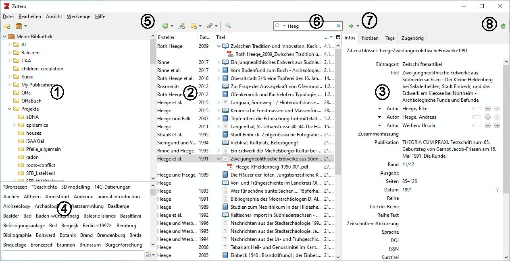
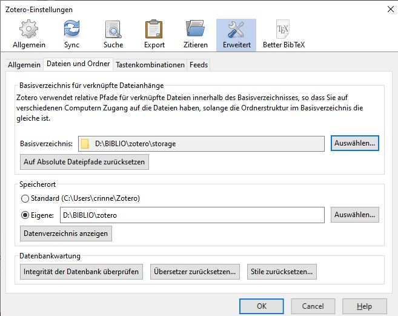

```{r setup, include=FALSE}
knitr::opts_chunk$set(echo = TRUE)
```

# Grundlegende Information

Zotero ist mehr als eine Literaturdatenbank, für Ihr Studium
liegen hier aber die Stärken. Sie ist frei, unabhängig vom Betriebssystem und weit verbreitet. Diese Handreichung ist für den Einstieg, weitere Informationen finden Sie im Internet. Einige Vorteile sind:

- Quelle: [https://zotero.org](https://zotero.org)
- Zitate & Literaturliste in MS Word und Libre Office 
- Verwaltung angehängter Dateien, z.B. PDF 
- Übernahme bibliografischen Daten, z.B. aus [GVK](https://kxp.k10plus.de/DB=2.1/LNG=DU/) 
- Viele Zitierstile für korrekte Literaturlisten 
- Synchronisation über freien webspace 

Die **Registrierung** ist für den *download* und die Nutzung nicht notwendig. Ein Konto bietet aber freien webspace für die Synchronisation und eine öffentlich sichtbare Liste eigener Publikationen. Hinzu kommen  Gruppenbibliotheken: geschlossen, sichtbar oder offen und einiges mehr.  

- persönliche Publikationsliste C. Rinne 
- offene Gruppenbibliothek Archaeology DGUF

Zotero gehört zur [Corporation for Digital Scholarship](https://digitalscholar.org/), diese versteht sich ausdrücklich als *nonprofit organization*. Partner sind u.a. das [Roy Rosenzweig Center for History and New Media](https://rrchnm.org/) und die [Michigan State University](https://msu.edu/).  


 
# Schnelleinstieg

1. Oberste Ebene mit der eigenen Bibliothek, untergeordnet sind einzelne Sammlungen (Auswahlsätze oder Sichten) aus dem Datenbestand. Sammlungen können mit drag & drop verschoben werden. 
2. Inhalt des unter (1.) ausgewählten Datenbestandes. Einträge können mit drag & drop in eine andere Sammlung unter (1.) verschoben werden. Die Spalten lassen sich sortieren, verschieben und auswählen (Liste-Icon am rechten Menürand). Doppelklick auf den Titel öffnet die angehängte Datei oder den bei „URL“ eingetragenen Weblink. 
3. Das unter (2.) ausgewählte Zitat kann hier editiert werden. Zu jedem Zitat gehören noch Notizen, Tags und Zugehörig (z. B. die Beiträgen in einem Sammelband). Die Eintragsart kann durch Auswahl eines anderen Typs aus der hinterlegten Drop- Down-Liste geändert werden; zugehörige Felder werden automatisch eingeblendet und überflüssige Felder samt Inhalt entfernt. Zwischen Autor und Herausgeber kann gewechselt werden, im selben Drop-Down-Menü findet sich auch eine Option zum Verändern der Reihenfolge der Autoren. Per Mausklick auf „Zusammenfassung“ wird zwischen einzeiliger und mehrzeiliger Ansicht für dieses Feld gewechselt. 
4. Alle vorhandenen Tags. Mit einem linken Mausklick auf einen Begriff wird auf diesen in ‚ gefiltert oder die Auswahl wieder aufgehoben. Schlagworte können mit Farben differenziert werden 
5. Icons für gängige Aktionen wie Neuer Datensatz, Eintrag aus aktueller Website oder Datei an aktuelles Zitat anhängen. 
6. Filter auf den eingetragenen Begriff. Mit der Lupe links startet die erweiterte Suche. 
7. Kann den unter (2.) ausgewählten Eintrag im Katalog einer Bibliothek suchen (s. in den OpenURL Einstellung). Fest implementiert ist die Suche bei Google-Scholar (Lookup- Engines). 
8. Synchronisieren der eigenen Bibliothek mit einem Server

# Einstellungen



Unter \<Bearbeiten> – \<Einstellungen> können Sie Zotero an persönliche Bedürfnisse anpassen.

- Den **Speicherort** (\<Erweitert> – \<Dateien ...>) sollten Sie bewusst wählen, schließlich sind es Ihre mühevoll gesammelten Daten. Zotero trennt zwischen dem Speicherort für Dateianhänge, z.B. digitale Kopien, und der Datenbank (SQLite). Die Dateianhänge werden mit einem relativen Pfad zum angegeben Basisspeicher versehen, dadurch können die Dateien auf jedem Endgerät z. B. auf unterschiedlichen Laufwerken liegen.
- Zum **Zitieren** müssen die Add-Ins für MS Word und/oder Libre Office installiert werden (\<Zitieren> –  \<Textverarbeitung...>). Stile für Zitate (\<Zitieren> – \<Stile>) können verwaltet, ausgewählt und der Standard vorgegeben werden. Nicht verwendete Stile können Sie entfernen (**-**), und aus dem Repositorium können alle Stile einfach neu installiert werden. 
- Der **Export** (\<Export>) erlaubt einfaches drag & drop von Zitaten aus (2) (s. Abb. 1)‚ in andere Anwendungen im hier ausgewählten Stil.
- Mit einem Zotero-Konto können eigene und Gruppenbibliotheken **synchronisiert** werden (\<Sync> – \<Einstellungen>). Dies erfolgt automatisch oder im Menü mit dem grünen Pfeil (8) (s. Abb. 1). Sie sollten nur die Datenbank und nicht die Dateianhänge synchronisieren, der freie Speicher ist sonst schnell verbraucht.

# Zitate importieren

Der Import einer Vielzahl von Dateiformaten ist möglich. Hierbei handelt es sich überwiegend um strukturierte Textformate (*.bib, *.json, *.xml, *.html), die aus allen gängigen Literaturdatenbanken exportiert werden können. Das Formate [BibTeX](http://www.bibtex.org/) ist besonders weit verbreitet, gut Strukturiert und damit eine gute Option. Das Format [BibLaTeX](https://www.ctan.org/pkg/biblatex) bietet eine nochmals erweiterten Optionsumfang. Der Import aus einer Tabelle ist nicht vorgesehen. 

Aus offenen **Gruppenbibliotheken** können Zitate per drag & drop in die eigene Bibliothek übernommen werden. 

Aus **Bibliothekskatalogen** und Online-Repositorien kann das Zitat direkt importiert werden, sofern zulässig werden Dateianhänge (z.B. Artikel) mit kopiert. Dafür muss der [Zotero Connector](https://www.zotero.org/download/connectors) installiert werden (Firefox, Chrome, Safari). Rechts im Menü des Browser finden Sie nun je nach Seiteninhalt ein passendes Icon (Buch, Seite etc.) auf das Sie einfach klicken. 

Ein PDF kann per drag & drop in eine Bibliothek (1) (s. Abb. 1) kopiert werden, Zotero importiert es und sucht über Metadaten automatisch ein passendes Zitat.

