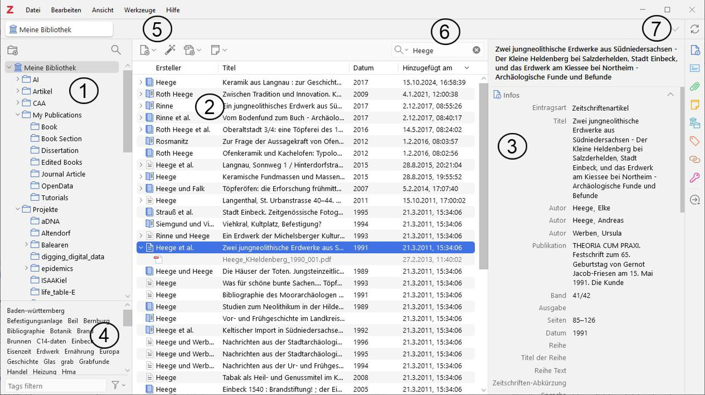
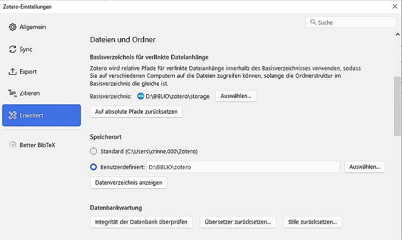

```{r setup, include=FALSE}
knitr::opts_chunk$set(echo = TRUE)
```

 
| Hinweise zur Darstellung |
|:----|
| Menüeinträge: "Datei > Speichern" |
| Tasten (*short cuts*): \<str> + \<s> |
| Formularschalter: [OK] |
| Variablennamen: \<Nachname>, \<Vorname> |
| Icons werden nicht abgebildet sondern in Einzelfällen durch vergleichbare typografische Zeichen in Fett ersetzt (**+**). |

# Grundlagen

## Grundlegende Information

Zotero ist mehr als eine Literaturdatenbank, für Ihr Studium
liegen hier aber die Stärken. Sie ist frei, unabhängig vom Betriebssystem und weit verbreitet. Diese Handreichung ist für den Einstieg, weitere Informationen finden Sie im Internet. Einige Vorteile sind:

- Quelle: [https://zotero.org](https://zotero.org)
- Zitate & Literaturliste in MS Word und Libre Office 
- Verwaltung angehängter Dateien, z.B. PDF 
- Übernahme bibliografischen Daten, z.B. aus [GVK](https://kxp.k10plus.de/DB=2.1/LNG=DU/) 
- Viele Zitierstile für korrekte Literaturlisten 
- Synchronisation über freien webspace 

Die **Registrierung** ist für den *download* und die Nutzung nicht notwendig. Ein Konto bietet aber freien webspace für die Synchronisation und eine öffentlich sichtbare Liste eigener Publikationen. Hinzu kommen  Gruppenbibliotheken: geschlossen, sichtbar oder offen und einiges mehr.  Diese Handeichung ist online verfügbar [GitHub: Softwarebox - Zotero](https://github.com/chrinne/Softwarebox_DGUF/blob/master/software/zotero/zotero.pdf) und ist kein Ersatz für die Dokumentation in Web [https://www.zotero.org/support/](https://www.zotero.org/support/).

Zotero gehört zur [Corporation for Digital Scholarship](https://digitalscholar.org/), diese versteht sich ausdrücklich als *nonprofit organization*. Partner sind u.a. das [Roy Rosenzweig Center for History and New Media](https://rrchnm.org/) und die [Michigan State University](https://msu.edu/).  



## Schnelleinstieg

1. Oberste Ebene mit der eigenen Bibliothek, untergeordnet sind einzelne Sammlungen (Auswahlsätze oder Sichten) aus dem Datenbestand. Sammlungen können mit *drag & drop* verschoben werden. 
2. Inhalt des unter (1.) ausgewählten Datenbestandes. Einträge können mit *drag & drop* in eine andere Sammlung unter (1.) verschoben werden. Die Spalten lassen sich sortieren, verschieben und auswählen (Kontextmenü / rechte Mausklick). Doppelklick auf den Titel öffnet die angehängte Datei oder den bei „URL“ eingetragenen Weblink. 
3. Das unter (2.) ausgewählte Zitat kann hier editiert werden. Zu jedem Zitat gehören weitere Informationen, u.a. Citation key (BibTeX), Notizen, Tags und Zugehörig (z. B. die Beiträgen in einem Sammelband). Die **Eintragsart** kann durch die Auswahl eines anderen Typs aus der hinterlegten Dropdown-Liste geändert werden; zugehörige Felder werden automatisch eingeblendet und überflüssige Felder samt Inhalt entfernt. Zwischen Autor und Herausgeber kann gewechselt werden, im selben DropDown-Menü findet sich auch eine Option zum Verändern der Reihenfolge der Autoren. \[]\[] wechselt zwischen \<Nachname>, \<Vorname> und \<Vorname> \<Nachname. 
4. Alle vorhandenen Tags (Schlagworte). Mit einem linken Mausklick auf einen Begriff wird auf diesen in (2.) gefiltert oder die Auswahl wieder aufgehoben. Im Kontextmenü zum Schlagwort kann dieser eingefärbt oder bearbeitet werden. Der Trichter differenziert zwischen den eigenen Schlagworten und den automatisch aus Bibliothekskatalogen übernommenen, die oft verkettet sind.
5. Icons für einzene Aktionen wie "Neuer Datensatz", der Typ wird im Dropdown-Menü bestimmt, Eintrag per DOI und ergänzende Datei oder Notiz. Die Übernahme von Zitaten aus einem Onlinekatalog erfolgt im Browser (Plugin [Zotero Connector](https://www.zotero.org/download/connectors)).
6. Filter auf den eingetragenen Begriff. Mit der Lupe wird die erweiterte Suche aufgerufen. 
7. Synchronisieren der eigenen Bibliothek mit einem Server. Die farbigen Icons darunter navigieren in (3.) zu der jeweiligen Information.  



## Einstellungen

Unter "Bearbeiten > Einstellungen" können Sie Zotero an persönliche Bedürfnisse anpassen.

- Den **Speicherort** unter "Erweitert > Dateien ..." sollten Sie bewusst wählen, schließlich sind es Ihre mühevoll gesammelten Daten. Zotero trennt zwischen dem Speicherort für Dateianhänge, z.B. das zugehörige PDF, und der Datenbank (SQLite). Die Dateianhänge werden mit einem relativen Pfad zum angegeben Basisspeicher versehen, dadurch können die Dateien auf jedem Endgerät z. B. auf unterschiedlichen Laufwerken liegen. Meine Dateiablage wird per Nextcloud synchronisiert (Icon), die Anhänge stehen mir auf allen Endgeräten zur Verfügung. Alternativ s. **Sync**.
- Zum **Zitieren** müssen die Add-Ins für MS Word und/oder Libre Office installiert werden ("Zitieren > Textverarbeitung..."). Stile für Zitate "Zitieren > Zitieren") können verwaltet, ausgewählt und der Standard vorgegeben werden. Nicht verwendete Stile können Sie entfernen (**-**), und aus dem Repositorium (Zusätzliche Stile erhalten) können alle Stile einfach neu installiert werden. 
- Der **Export** ("Export") erlaubt einfaches drag & drop von Zitaten aus (2) (s. Abb. 1) in andere Anwendungen im hier ausgewählten Stil.
- Mit einem Zotero-Konto können eigene und Gruppenbibliotheken **synchronisiert** werden. Unter "Sync > Einstellungen" können Sie Ihre Anmeldedaten hinterlegen und die zu synchronisierenden Biblotheken, z.B. Gruppenbiblotheken aus- oder abwählen. Die Synchronisation erfolgt automatisch oder im Menü mit dem kreisenden Pfeilen (7) (s. Abb. 1). Sie können auch die Dateianhänge mit dem Zotero-Server synchronisieren, der freie Speicher bei Zotero ist dann aber schnell verbraucht. Eine weitere Alternative ist ein WebDAV-Dienst.

## Zitate importieren

Der Import einer Vielzahl von Dateiformaten ist möglich. Hierbei handelt es sich überwiegend um strukturierte Textformate (*.bib, *.json, *.xml, *.html), die aus allen gängigen Literaturdatenbanken exportiert werden können. Das Format [BibTeX](http://www.bibtex.org/) ist besonders weit verbreitet, gut Strukturiert und damit eine gute Option. Das Format [BibLaTeX](https://www.ctan.org/pkg/biblatex) bietet eine nochmals erweiterten Optionsumfang. Der Import aus einer Tabelle ist nicht vorgesehen. 

Aus offenen **Gruppenbibliotheken** können Zitate per drag & drop in die eigene Bibliothek übernommen werden. 

Aus **Bibliothekskatalogen** und Online-Repositorien kann das Zitat direkt importiert werden. Sofern zulässig werden Dateianhänge, z.B. Artikel, mit kopiert. Dafür muss der [Zotero Connector](https://www.zotero.org/download/connectors) installiert werden (Firefox, Chrome, Safari). Rechts im Menü des Browser finden Sie nun je nach Seiteninhalt ein passendes Icon (Buch, Seite etc.) auf das Sie einfach klicken. 

Ein PDF kann per drag & drop in eine Bibliothek (1) (s. Abb. 1) kopiert werden, Zotero importiert es und sucht über Metadaten automatisch ein passendes Zitat. Ist das Zitat schon vorhanden kann das PDF per *drag & drop* dort angehängt werden.

## Zitate einfügen

Mit (**+**) in der Icon-Leiste können Zitate von Hand erfasst werden. Das Kontextmenü (rechte Mausklick) für vorhandene Zitate in (2) (s. Abb. 1)‚ ermöglicht u.a. das Duplizieren des Zitates. Weitere Beiträge eines Sammelbandes können so schnell ergänzt werden. Zahlreiche Autoren können aus der Zwischenablage als Liste eingefügt werden: eine Autorin / ein Autor je Zeile und entsprechend der gewählten Vorgabe \[]\[] \<Vornanme> \<Nachname> oder \<Nachname>, \<Vorname>. 

## Zitieren in Word und Libre Office

Nach der Installation des jeweiligen Add-Ins (s. Einstellungen) finden Sie einen eigene Reiter für Zotero. Die Handhabung ist unmittelbar ersichtlich. Bei der erstmaligen Verwendung im Dokument wird der Zitierstil festgelegt, er kann jederzeit geändert werden [Document preferences]. Neben der einzeiligen Einfügemaske kann mit dem **Z** auch ein erweitertes Formular geöffnetn werden (z. B. Name unterdrücken, nur Jahreszahl). [Add/edit Bibliography] fügt die Literaturliste für alle Zitate ein. Das Ergebnis ist nicht zwingend absolut korrekt (Fehler in der Datenbank oder Differenzen zum gewünschten Stil) und sollte stets kontrolliert werden. Mit [Unlink Citations] werden die Funktionen unumkehrbar in reinen Text konvertiert.

## BibTeX, Markdown und RStudio oder Quarto

Texte in Markdown können mit Zitaten auf eine BibTeX-Datei mit Literatur verweisen. Besonders einfach ist dies z.B. in [RStudio](https://bookdown.org/yihui/rmarkdown-cookbook/bibliography.html) oder [Quarto](https://quarto.org/docs/authoring/citations.html). Die benötigte Literatur wird in Zotero z.B. aus einer Sammlung für den Artikel in eine (Better) BibTeX-Datei exportiert. Der erste Eintrag je Zitat ist der *citation key*, dieser wird als Verweis im Text eingefügt: ```[@rinneHandreichungZoteroYour2020, 1]```. Zudem muss ein Zitierstil vorliegen (csl-Datei) und auf diese sowie die BibTeX-Datei im Markdown-Dokument verwiesen werden (YAML-header).

## Weitere lokale Einstellungen

Unter "Bearbeiten > Einstellungen > Allgemein" wird vor allem die Verarbeitung von Dateianhängen verwaltet. Hier können Sie: das automatische Anhängen von Schnappschüssen oder zugehöriger Artikel (PDF) steuern, Dateien automatisch umbenennen lassen, PDF's in Zotero oder mit dem Standard des Betriebssystems (OS) öffnen und das Finden des Zitates in einem Bibliothekskatalog einstellen.

**Suchen & Ersetzen** ist ein Dauerthema und leider noch nicht unkompliziert möglich: [Link zum Zotero-Forum](https://forums.zotero.org/discussion/115166/find-and-replace).

## Einstellungen im Onlinekonto

Neben den üblichen Einstellungen kann unter "\<Name> > My Profile > Edit Profile > C.V. (curriculum vitae)" die **eigene Publikationsliste im Web** an das öffentlich sichtbare Profil angehängt werden. Zuerst wird ein Stil gewählt, bevorzugt einer mit absteigender Sortierung des Erscheinungsjahrs. Nachfolgend werden für eine einzelne Kategorie (Buch, Buchteil, Zeitschrift etc) die zuvor jeweils angelegte  Sammlung der eigenen Bibliothek im Web gewählt. Ausschließlich die Zitate dieser Sammlungen werden angezeigt. Fügen Sie lokal ein Zitat in die Sammlung "meine Artikel" ein und synchronisieren Sie anschließend die Bibliothek, ist Ihre Publikationsliste im Netz direkt aktualisiert. [https://www.zotero.org/crinne/cv](https://www.zotero.org/crinne/cv)

Sie können auf Ihre Literaturdatenbank weltweit zugreifen. 

Unter "Settings > Privacy" können Sie Ihre Literaturdatenbank veröffentlichen. Davon getrennt kann dies auch für angehängte Notizen eingestellt werden. Sie können das Indexieren Ihres Profils durch Suchmaschinen verhindern.

## Arbeiten mit PDF und Kommentaren

Seit der Version 6 verfügt Zotero über einen PDF-Reader und Editor für Kommentare [https://www.zotero.org/support/pdf_reader](https://www.zotero.org/support/pdf_reader). Das eröffnet einige sehr interessante Optionen, die wichtigste ist: 

Markierungen und Kommentare in einem PDF können in Notizen in der Zoterodatenbank überführt, hier recherchiert und für die Navigation genutzt werden. **Wichtig**: Wenn Sie in Zotero markieren und kommentieren ist dies nur in Zotero vorhanden. Öffnen Sie lieber das PDF in Ihrem PDF-Reader und arbeiten Sie dort. Überführen Sie nachträglich alle Kommentare in die Literaturdatenbank (s.u.)

Mit einem Doppelklick auf ein PDF oder mit "PDF öffnen" im zugehörigen Kontextmenü  wird das PDF in einem neuen Reiter von Zotero geöffnet. Links haben Sie wahlweise eine Seitenvorschau, eine Kommentarliste oder die Gliederung. Rechts können Sie mit dem gelben Icon die Notizen zu diesem Dokument und auch alle anderen Notizen einblenden. Die Markierungen / Anmerkungen in einem PDF können im Kontextmenü zum PDF in (2) (s. Abb. 1) in eine Notiz überführt werden.  Die Notizen sind mit "Anmerkungen" und Datum als auch Uhrzeit versehen und stehen dann ebenfalls rechts für die schnelle Recherche bereit. Klicken Sie auf eine Notiz, wird diese vollständig angezeit, Sie können alles gut lesen und mit einem Klick auf einen Eintrag zu dieser Stelle im Dokument springen [Auf Seite anzeigen].  Zudem ergeben sich über die zugehörige Iconleiste oben zahlreiche weitere Optionen. Mit [...] > "In Bibliothek anzeigen" (Kontextbezogen bei "fremder" Notiz) wird in der Liste Ihrer Zitate (2) (s. Abb. 1) zu dem in der Liste der Notizen gewählten Eintrag gesprungen.

## Interessante Plugins 

Zotero kann mit Plugins von Dritten an persönliche Bedürfnisse angepasst werden. Einige Beispiele: 

### Better Bib Tex: [http://retorque.re/zotero-better-bibtex/](http://retorque.re/zotero-better-bibtex/) 

Dieses Plugin ist für Sie von Interesse wenn Sie mit Markdown in RStudio oder Quarto arbeiten. Better BibTeX  ist eine Erweiterung von BibTeX. Es gab Diskussionen über eine Verlangsamung von Zotero durch dieses Plugin, dabei handelte sich um das verzögerte Laden durch die Indexierung.  Mit Zotero 7 ist dies behoben und BibTeX mit dem *citation key* offensichtlich weitgehend performant implementiert.

### Zotfile: [http://zotfile.com/](http://zotfile.com/) 

Mit Zotero 7 überflüssig und inaktiv falls vorab installiert.

### Zutilo: [https://github.com/willsALMANJ/Zutilo](https://github.com/willsALMANJ/Zutilo) 

Mit Zotero 7 überflüssig und inaktiv falls vorab installiert.
